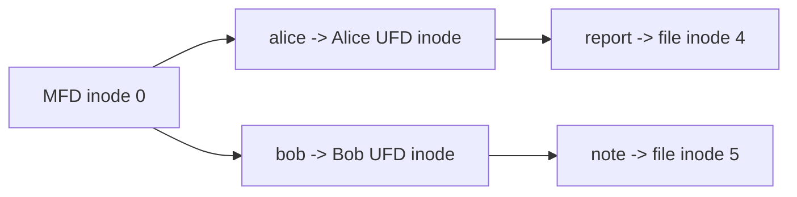

# 十分钟看懂 OSFS

先纠正一个容易混淆的缩写：这里是 **OSFS**，可以理解为 Operating System File System 课程设计模块，不是网络路由协议 OSPF。它位于 mini-kv 仓库中，但不是把 KV 数据改存到文件系统，也不会接管 WAL、snapshot 或 TCP。它是一套独立的教学文件系统，用一个二进制 `.img` 文件模拟磁盘。

## 先看一次完整操作

启动命令给 OSFS 三个输入：可执行程序、镜像路径、是否格式化。格式化会建立超级块、两个位图、用户表、inode 表、MFD 和三个预置用户的 UFD。

```powershell
.\build\minikv_osfs.exe --disk osfs-course.img --format --blocks 160
```

进入 shell 后，可以执行：

```text
LOGIN alice alice123
CREATE report
OPEN report w
WRITE 3 course-design
TELL 3
CLOSE 3
DIR
FSCK
QUIT
```

关键输出是：

```text
OK login alice uid=1000
OK created report
OK fd=3
OK wrote 13 bytes offset=13
fd=3 read_offset=0 write_offset=13
name inode physical mode owner size
report 4 20 0644 1000 13
FSCK OK checks=6
```

这几行已经把项目的主要机制串了起来。Alice 的身份来自磁盘用户表；`report` 被登记在 Alice 的 UFD 中；目录项指向 inode 4；inode 再指向物理数据块 20；fd 3 在内存中保存写偏移 13；FSCK 最后重新扫描磁盘结构，确认位图、inode、目录和用户关系彼此一致。

## 一张图看清层次


可以把这套层次想成一次寄件。命令处理器先确认“谁在操作、手里拿的是哪个 fd”；文件系统层找到用户目录和文件 inode；磁盘布局层把“逻辑第几个数据块”换成真实块号；VirtualDisk 最终在 `.img` 的确定偏移处读写 512 字节。

## 磁盘里有什么

镜像不是把所有对象随便序列化进去，而是有固定布局：

```text
Block 0     SuperBlock：版本、块数、inode 数、各区域起点、空闲计数
Block 1     block bitmap：哪些物理块已占用
Block 2     inode bitmap：哪些 inode 已占用
Block 3     user table：用户名、uid、gid、密码摘要、UFD inode
Block 4..N  inode table：文件类型、权限、所有者、大小、时间、块指针
Data area   MFD、各用户 UFD、普通文件数据、一级间接块
```

默认块大小是 512 字节。每个 inode 固定 96 字节，里面有八个直接块号和一个一级间接块号。小文件直接从 inode 找到数据；超过 `8 * 512 = 4096` 字节后，inode 通过间接块中的块号数组继续寻找数据。

## 为什么叫二级目录

第一级 MFD 保存用户名到 UFD inode 的映射，第二级 UFD 保存该用户的文件名到普通文件 inode 的映射：



因此 Bob 执行 `DIR` 看不到 Alice 的 `report`，不是输出时临时按 owner 过滤，而是 Bob 和 Alice 读取了不同 UFD 的目录块。root 可以用 `DIR alice` 审查 Alice 的目录，普通用户则不能随意跨 UFD 查看。

## 内存状态和磁盘状态要分开

fd 表只存在于当前 shell 进程中。`OPEN report w` 返回 fd 3，并建立 `read_offset`、`write_offset`；重新登录会清空 fd 表，旧 fd 随即变成 `ERR bad fd`。文件内容、inode、目录项、用户表和位图写在镜像里，进程退出后重新打开仍然存在。

这个区别是操作系统课设的重点。文件描述符是一次会话中的访问句柄，inode 是磁盘上的文件身份。fd 可以消失，inode 和数据仍然留在镜像中。

## 项目完成到什么程度

OSFS 已实现二进制模拟磁盘、超级块、双位图、inode、持久化用户、MFD/UFD、登录、权限、目录显示、创建删除、fd 读写、SEEK/TELL、直接块与一级间接块、只读 FSCK、USERADD 和 PASSWD。测试还覆盖重开持久化、空间不足时保留旧数据、目录跨块增长、组权限、稀疏区间写和两种位图损坏。

它没有实现任意深度目录、二级或三级间接块、FSCK 自动修复、日志型文件系统、多进程并发和生产级密码派生。这里的教学目标是把核心机制做实并能解释，而不是复刻完整 Linux EXT 文件系统。

接下来读 [01-CREATE到WRITE完整流程.md](01-CREATE到WRITE完整流程.md)，可以看到上面一组命令怎样一步步改变内存和磁盘。
