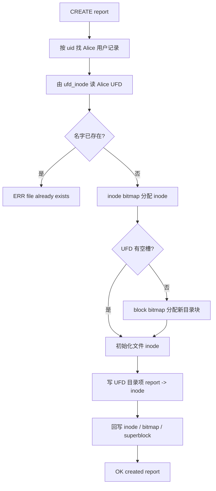

# 从 CREATE 到 WRITE 看完整流程

这篇只追一件事：Alice 输入 `CREATE report`，随后写入 `course-design`，程序内部到底经过了哪些对象，磁盘上的哪些字节发生了变化。

## 输入、输出和起始状态

```text
LOGIN alice alice123
CREATE report
OPEN report w
WRITE 3 course-design
CLOSE 3
```

对应输出：

```text
OK login alice uid=1000
OK created report
OK fd=3
OK wrote 13 bytes offset=13
OK closed 3
```

执行前，磁盘已有 Alice 的用户记录和 UFD，但 UFD 中没有 `report`。执行后新增一个普通文件 inode、一个 UFD 目录项和一个数据块；block bitmap、inode bitmap、超级块空闲计数也会同步变化。fd 3 则只在进程内短暂存在，`CLOSE` 后消失。

## CREATE 先建立“名字到 inode”的关系

命令入口是 `src/osfs_command_processor.cpp` 中的 `CommandProcessor::execute`。它先把命令转换为大写，确认已经登录，再把当前 uid 传给 `FileSystem::create_file`。

`create_file` 的顺序很重要：

1. 检查文件名是否合法，拒绝空名、`.`、`..`、斜杠和过长名称。
2. 从用户表按 `actor_uid=1000` 找到 Alice，得到她的 `ufd_inode`。
3. 读取 inode 表和 Alice UFD 的目录项，确认 `report` 不重名。
4. 从 inode bitmap 找一个空闲 inode。如果没有，返回 `inode table is full`。
5. 在 UFD 中找空目录槽。如果当前目录块已满，先为 UFD 再分配一个目录数据块。
6. 初始化普通文件 inode：`used=1`、`type=1`、权限 `0644`、owner 为 Alice、size 为 0，并设置三个时间字段。
7. 在 UFD 槽位写入 `name=report` 和新 inode 号。
8. 最后回写目录项、inode 表、两个位图、超级块和空闲计数。



此时 `report` 还是空文件，所以 `DIR` 中 `physical` 可以是 0。创建文件分配的是 inode，不会为了空内容提前占用数据块。

## OPEN 建立 fd，不是再建一个文件

`OPEN report w` 进入 `CommandProcessor::open_file`。它先用 `FileSystem::stat` 确认文件存在，再检查写权限。模式 `w` 会调用 `truncate_file` 清空旧数据。随后命令处理器在内存 `handles_` 表中插入：

```text
fd = 3
name = report
readable = false
writable = true
read_offset = 0
write_offset = 0
```

这个 Handle 不写入磁盘。另一个进程不会看到相同 fd，重新登录也会清空它。`next_fd_` 从 3 开始递增，符合常见系统中 0、1、2 留给标准输入输出错误的教学习惯，但 OSFS 并没有真的复用操作系统内核 fd。

## WRITE 才分配数据块

`WRITE 3 course-design` 先从 `handles_` 找到 fd 3，确认它可写，然后调用：

```cpp
fs_.write_file_range("report", 0, "course-design", 1000, &error)
```

`write_file_range` 的主要步骤是：

1. 由当前用户和文件名再次定位 Alice UFD 中的目录项，再取得普通文件 inode。
2. 按 owner、group、other 三组权限位检查写权限，root 直接通过。
3. 计算目标大小 `max(旧大小, offset + 内容长度)`。这里是 13 字节。
4. 用向上取整算所需逻辑块数：`(13 + 511) / 512 = 1`。
5. `ensure_inode_data_blocks` 从 block bitmap 分配一个数据块，清零后写进 `direct[0]`。
6. 计算逻辑块号 `file_offset / 512` 和块内偏移 `file_offset % 512`，执行读、改、写。
7. 更新 inode 的 size 和 modified_at，重写 inode 表、block bitmap 与超级块空闲计数。
8. 命令处理器把 Handle 的 `write_offset` 从 0 增加到 13，返回 `OK wrote 13 bytes offset=13`。

这里有两套位置不要混淆：inode 的 `size=13` 是磁盘持久状态；Handle 的 `write_offset=13` 是本次打开会话的内存状态。

## 为什么先做容量预检

覆盖整个文件的 `write_file` 会先算新内容需要多少数据块，再把当前文件已占的块计入“可回收容量”。只有确认总空间足够，才释放旧数据并重新分配。`test_failed_rewrite_preserves_existing_data` 专门构造磁盘接近写满的情况，要求大覆盖失败后旧内容仍为 `old contents`。没有这一步，程序可能先删旧块，再发现新空间不足，把原文件也弄丢。

区间写 `write_file_range` 则只补足缺少的块，不释放已有数据。写入跨块时，循环每次只处理当前块剩余空间，因此偏移 508 写入 14 字节会先改第一个块的最后 4 字节，再改第二个块的前 10 字节。

## 失败时输出怎样回到用户

文件系统方法返回 `bool` 或 `optional`，并通过 `error` 字符串给出原因。命令处理器把它统一变成 `ERR ...`：

| 失败点 | 输出示例 | 没有发生什么 |
|---|---|---|
| 未登录 | `ERR login required` | 不读用户 UFD，不分配 inode |
| 重名 | `ERR file already exists` | 不改目录和位图 |
| 无 inode | `ERR inode table is full` | 不写目录项 |
| 无块 | `ERR no free data block` | 预检路径保留旧内容 |
| 权限不足 | `ERR permission denied` | 不更新数据和时间 |
| fd 已关闭 | `ERR bad fd` | 不进入 FileSystem I/O |

## 哪些测试证明这条链

`tests/osfs_tests.cpp` 中，`test_authenticated_command_shell` 走真实命令入口；`test_descriptor_offsets_and_range_io` 保护连续写、读偏移、覆盖、append 和跨块读写；`test_failed_rewrite_preserves_existing_data` 保护失败原子性；`test_disk_users_and_two_level_directories` 保护 UFD 定位与权限。

`tests/osfs_resilience_tests.cpp` 又补了旧 fd 在登录切换后失效、只读 fd 不能 WRITE、只写 fd 不能 READ、目录第九个条目触发第二个 UFD 数据块、删除后槽位复用和稀疏区间零填充。这样，CREATE/WRITE 不只在一条顺利路径上成立。
