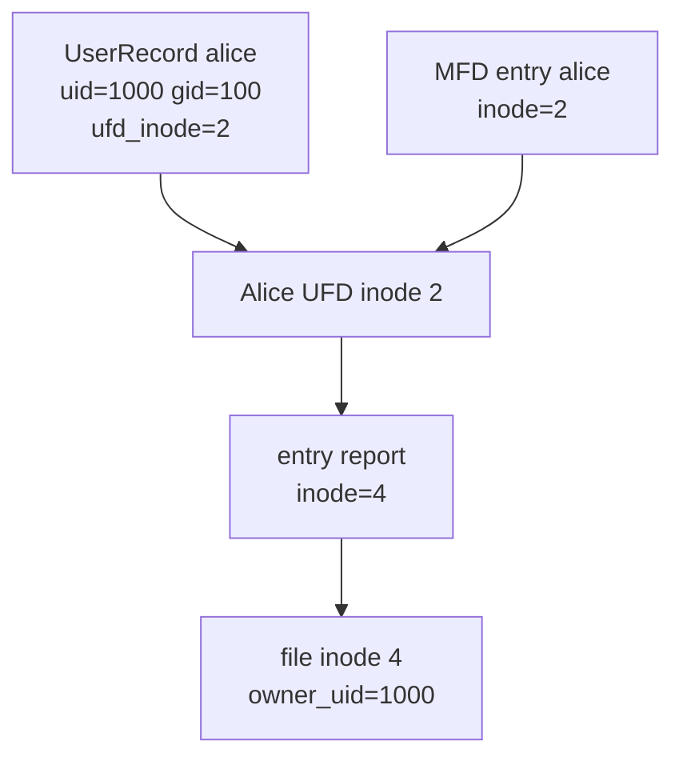

# 用户表与 MFD/UFD 二级目录

“二级目录”不是目录最多能点开两层，而是一种经典教学模型：第一级主文件目录 MFD 按用户名找用户目录，第二级用户文件目录 UFD 按文件名找该用户的文件。OSFS 保留这个模型，不扩展成任意深度树。

## 格式化后已经有哪些用户

当前磁盘格式会预置三个教学账号：

| 用户 | 密码 | uid | gid |
|---|---|---:|---:|
| root | root | 0 | 0 |
| alice | alice123 | 1000 | 100 |
| bob | bob123 | 1001 | 100 |

所以新镜像上可以直接 `LOGIN alice alice123`。早期 FinalShell Step 04-06 在格式化后又执行 `USERADD alice` 或 `USERADD bob`，这些调用实际会因为用户已存在而失败，只是当时的 grep 把错误行过滤掉了。它们不能作为“创建 Alice/Bob 成功”的证据。本轮复核说明已经把这点单独披露，新的现场演示应直接使用预置账号，新增用户则使用 Carol 之类没有占用的名字。

## MFD 和用户表为什么要同时存在

用户表保存认证和身份信息，MFD 保存目录层次入口。每个用户记录都有 `ufd_inode`，MFD 中同名目录项也指向这个 inode。两边看起来重复，其实用途不同：

- 登录时按用户名在用户表中找密码摘要、uid、gid 和 UFD inode。
- 目录一致性检查时，用 MFD 确认每个用户在第一级目录中确实有入口。
- FSCK 会要求用户表的 `ufd_inode` 与 MFD 同名项完全一致。



如果只在 DIR 时按 owner 过滤一个共享根目录，就不会存在这两个独立指针，更无法让 Alice 和 Bob 的 UFD 分配不同目录数据块。现有测试会直接比较三个用户的 `ufd_inode`，要求彼此不同。

## LOGIN 改变了什么

`LOGIN alice alice123` 调用 `FileSystem::authenticate`。文件系统从块 3 读取用户表，用用户名找到记录，再比较 `password_hash(username, password)`。成功后，命令处理器把 `current_user_`、`current_uid_` 和 `authenticated_` 写入当前会话，并清空旧 fd 表。

错误密码返回 `ERR authentication failed`；未登录时执行 CREATE、DIR、OPEN、FSCK 等命令返回 `ERR login required`。登录只改变会话身份，不会把整个用户表复制到新的镜像，也不会启动操作系统级用户进程。

密码摘要目前采用带固定域前缀的 64 位 FNV-1a 教学实现。它能避免明文密码直接落盘，也能稳定复现，但不具备生产密码存储需要的盐、慢哈希和抗暴力破解能力。报告应把它称为教学用摘要，而不是安全密码数据库。

## DIR 怎样选中正确 UFD

不带参数的 `DIR` 使用当前用户 uid：

```text
LOGIN alice alice123
DIR
```

程序按 uid 找 Alice 用户记录，取 `ufd_inode`，读取该目录 inode 的直接块，再逐条解析 64 字节目录项。Bob 登录后走的是 Bob 的 UFD，因此看不到 Alice 的文件。

带用户名的 `DIR alice` 是管理审查路径。只有 root 或目录本人可以读取：

```text
LOGIN bob bob123
DIR alice
ERR permission denied

LOGIN root root
DIR alice
name inode physical mode owner size
report 4 20 0600 1000 13
```

## 带用户名的文件引用

普通文件名 `report` 默认解释为当前用户 UFD 下的文件。`alice/report` 则先按用户名找 Alice 的 UFD，再找 `report`。找到并不等于允许访问，后续仍按 inode 的 mode、owner_uid、owner_gid 检查权限。

这也是为什么 Bob 可以写出 `OPEN alice/report r`，但对 Alice 的 0600 文件会得到 `ERR permission denied`。root 通过 `uid=0` 规则拥有审查和管理权限。

## USERADD 一次要改哪些地方

root 执行 `USERADD carol carol123` 时，不只是向内存 vector 追加字符串。`FileSystem::add_user` 要完成一组一致写入：

1. 验证当前操作者是 root，用户名合法且未重复。
2. 在固定用户表中找到空槽，计算下一个 uid。
3. 分配一个 UFD inode 和一个 UFD 数据块并清零。
4. 初始化 UFD inode 的 owner、mode、时间和 `direct[0]`。
5. 写 Carol 的用户记录，包括 `ufd_inode` 和密码摘要。
6. 在 MFD 写 `carol -> Carol UFD inode` 目录项。
7. 更新用户数、空闲块数、空闲 inode 数、位图、inode 表、用户表和 MFD。

任何前置容量不足都会先返回错误。用户表只有八个槽，测试把它填满后要求第九个用户失败，并在最后再次运行 FSCK。

`PASSWD carol newpass` 允许 root 修改任意用户；普通用户使用 `PASSWD newpass` 只能改自己。重开镜像后旧密码失效、新密码仍可登录，证明变化写入了用户表而不是只改当前会话。

## 教学边界

OSFS 没有 `/home/alice/subdir` 这样的多级目录树，也没有用户删除、组管理、ACL、会话过期或生产认证服务。MFD/UFD 的价值在于让学生清楚看到“身份记录、目录入口、文件 inode”是三个不同概念，并能用磁盘结构和测试证明它们的关系。
