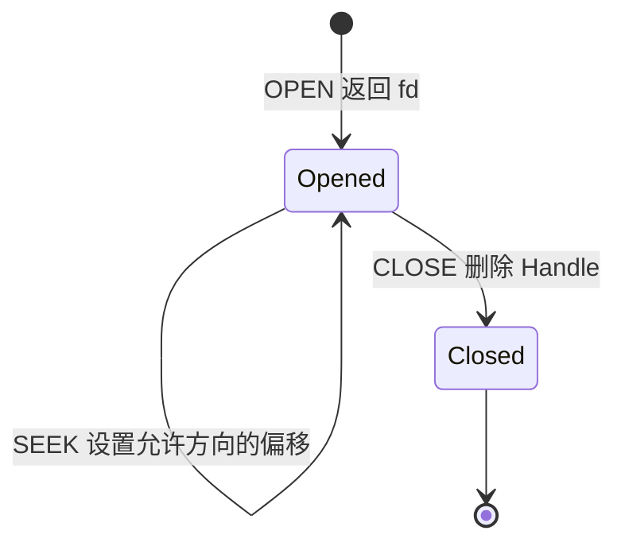

# 文件描述符、偏移与区间读写

文件已经在磁盘上，为什么还要 `OPEN`？因为程序需要一份只属于当前会话的访问状态：打开的是哪个文件、允许读还是写、下一次从哪里开始。OSFS 用 `Handle` 模拟这份状态。

## Handle 里保存什么

`include/minikv/osfs/command_processor.hpp` 中的结构很小：

```text
name
readable
writable
read_offset
write_offset
```

命令处理器用 `unordered_map<int, Handle>` 保存 fd 到 Handle 的映射，fd 从 3 开始。它不是磁盘 inode 号，也不是 Windows/Linux 内核真的给出的句柄。

| 打开模式 | 可读 | 可写 | 初始写偏移 | 额外行为 |
|---|---|---|---:|---|
| `r` | 是 | 否 | 0 | 保留原内容 |
| `w` | 否 | 是 | 0 | 先截断文件 |
| `rw` | 是 | 是 | 0 | 保留原内容，可覆盖 |
| `a` | 否 | 是 | 文件末尾 | 从 EOF 追加 |

## 为什么读写偏移要分开

用 `rw` 打开时，读和写可以各自推进。下面来自真实测试逻辑：

```text
OPEN stream rw       -> OK fd=5
SEEK 5 6             -> OK seek 5 6
WRITE 5 OSFS!        -> OK wrote 5 bytes offset=11
SEEK 5 0             -> OK seek 5 0
READ 5               -> hello-OSFS!
```

`SEEK` 对可读句柄更新 `read_offset`，对可写句柄更新 `write_offset`；`rw` 两个都更新。`READ` 成功后只增加读偏移，`WRITE` 成功后只增加写偏移。`TELL` 把两者都显示出来，避免把“文件大小”和“当前位置”混为一谈。



## READ 怎样跨块

`FileSystem::read_file_range` 接收文件名、offset、可选 length 和 uid。每一轮循环都计算：

```text
logical_index = file_offset / block_size
within_block  = file_offset % block_size
count         = min(剩余长度, 当前块剩余字节)
```

假设块大小 512，从 offset 508 读取 14 字节。第一轮逻辑块号 0、块内偏移 508，只能取 4 字节；第二轮逻辑块号 1、块内偏移 0，再取 10 字节。上层得到一个连续字符串，看不到内部跨了两次物理块读取。

读取到 EOF 返回 `(eof)`，但仍会更新 accessed_at。请求长度超过剩余文件时只返回实际剩余内容，不会越过 inode.size 读取块尾的填充字节。

## WRITE 为什么是读、改、写

区间写可能只覆盖一个块的中间几字节，所以不能把整块其他内容清掉。程序先读出目标物理块，在 `within_block` 位置复制当前片段，再把整块写回。跨块时重复这一过程。

如果 offset 大于原文件大小，`ensure_inode_data_blocks` 会分配覆盖目标区间所需的所有块，并把新块清零。比如在空文件 offset 600 写 `tail`，文件大小变成 604；前 600 字节必须为 `\0`，而不是未初始化垃圾。`test_sparse_range_write_zero_fills_gap` 会读取整段、跨 512 边界复核零填充，并在重开镜像后再读末尾四字节。

## 登录切换为什么要清 fd

Alice 打开的 fd 带着她的文件名和访问权限。如果登录 Bob 后仍能使用旧 fd，就可能绕开新的身份检查。`login` 因此执行：

```text
handles_.clear()
next_fd_ = 3
```

新增 resilience 测试先让 Alice 打开并写文件，再登录 Bob，随后要求旧 fd 的 READ 和 TELL 都返回 `ERR bad fd`。重新登录 Alice 后，新 fd 又从 3 开始。

同一测试还要求只读 fd 的 WRITE 返回 `ERR fd not writable`，append fd 的 READ 返回 `ERR fd not readable`，重复 CLOSE 返回 `ERR bad fd`。这些反例能证明 fd 模式不只是 HELP 文本中的装饰。

## fd 和持久化的关系

fd 不持久化，但通过 fd 写入的数据会持久化。演示时应分两段：第一次格式化、登录、写入、关闭并退出；第二次不带 `--format` 打开同一镜像，再登录并读取。第二次能读到内容，证明数据来自镜像；旧 fd 不能继续用，证明句柄属于旧会话。

已有 FinalShell Step 06 正是这样演示 `HELLO-LINUX`、TELL、SEEK 和重开读取。它是运行证据；`test_descriptor_offsets_and_range_io` 与 `test_login_switch_closes_descriptors` 则是会自动失败的回归证据。
