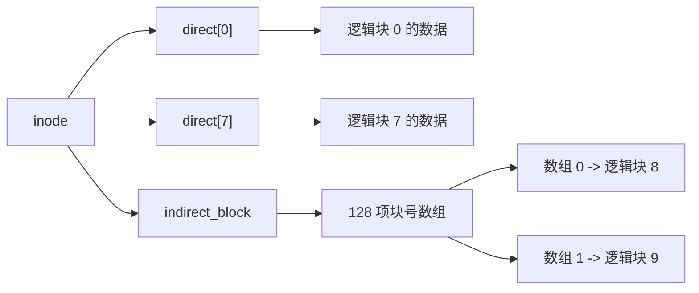

# 直接块与一级间接块

小文件只需要少量块号，直接把这些块号放进 inode 最简单；大文件需要更多块号，如果继续扩大 inode，每个文件都会浪费空间。OSFS 采用经典折中：inode 有八个直接块指针，再用一个指针找到“块号数组”，这就是一级间接块。

## 容量怎么算

`InodeDisk` 中有：

```text
direct[0..7]       8 个直接数据块号
indirect_block     1 个间接块自身的块号
```

间接块里保存 32 位块号。块大小为 512 字节时，一个间接块能放：

```text
512 / sizeof(uint32_t) = 512 / 4 = 128 个块号
```

因此文件最多引用：

```text
8 + block_size / 4 = 8 + 128 = 136 个数据块
136 * 512 = 69632 字节
```

这里的 136 都是数据块，间接块本身还额外占一个物理块。v1636 演示写入 4291 字节，需要 9 个数据块，再加 1 个间接块，共消耗 10 个空闲块。测试中的 4645 字节负载需要 10 个数据块和 1 个间接块，所以空闲块减少 11。

## 逻辑块怎样映射到物理块



`inode_data_block_at` 集中处理映射：逻辑号小于 8 时读 `direct[index]`；否则先确认 `indirect_block` 存在，读取块号数组，再访问 `entries[index - 8]`。读取、区间写和整文件写都调用这套映射，避免三处各写一套边界判断。

## 第九个数据块出现时发生什么

`ensure_inode_data_blocks` 先比较当前块数和目标块数。如果目标超过八块且 inode 还没有间接块，它会把“间接块自身”也计入新增空间：

```text
additional = 需要的数据块 - 当前数据块 + 1 个间接块
```

只有 block bitmap 中空闲块足够才继续。随后先分配并清零间接块，再分配第九个数据块，把它的物理块号写入间接数组第 0 项。以后的第十、第十一个数据块继续写数组第 1、第 2 项。

超过 136 个数据块时，写入在分配前返回 `file exceeds indirect-block limit`。这个上限不是报告里的描述文字，而是 `max_file_blocks`、区间写容量检查和测试共同约束的行为。

## 现场怎样看到跨界

直接块容量是 4096 字节。v1636 脚本把标记放在 offset 4088：

```text
...前 4088 字节...
DIRECT8|INDIRECT-BEGIN|YYYY...
```

写完后重新只读打开，并执行：

```text
SEEK 6 4088
READ 6 64
```

真实输出为：

```text
DIRECT8|INDIRECT-BEGIN|YYYYYYYYYYYYYYYYYYYYYYYYYYYYYYYYYYYYYYYYY
```

前 8 字节位于 `direct[7]` 的末尾，后面的内容进入逻辑块 8，也就是间接块数组第 0 项指向的数据块。一次 READ 返回连续字符串，说明映射层正确跨过了边界。

FinalShell 分段记录新增的 Step 08 提供了同类命令，但它只有在远端真实执行并填入输出后才能叫 Linux 实跑证据。当前已经存在的 [v1636 Linux run evidence](../课程设计交付/v1636-osfs-final/linux-run-evidence-20260706/README.md) 则包含完整 demo script 的已完成 Linux 运行。

## 删除和截断不能只释放直接块

如果删除大文件时只清 `direct[0..7]`，间接数据块和间接块自身会永久留在 bitmap 中，形成空间泄漏。`release_inode_storage` 会：

1. 释放并清零所有直接块。
2. 读取间接块数组，释放并清零每个非零数据块。
3. 释放并清零间接块自身。
4. 把 `inode.indirect_block` 置 0。

`test_indirect_blocks_persist_and_release` 在写入前记住空闲块数，写入大文件后检查减少 11，重开镜像验证跨界字节，再删除文件，最后要求空闲块数精确回到写入前。这个断言比“删除后 DIR 看不到文件”更强，因为它还能抓住块泄漏。

## 没有实现什么

OSFS 没有二级、三级间接块，也不支持稀疏块映射表中的洞。区间写到较远 offset 时，中间需要的块会被实际分配并清零。这样的设计容量有限，但公式、分配、读取、释放和 FSCK 都能在课程规模内讲清楚。
