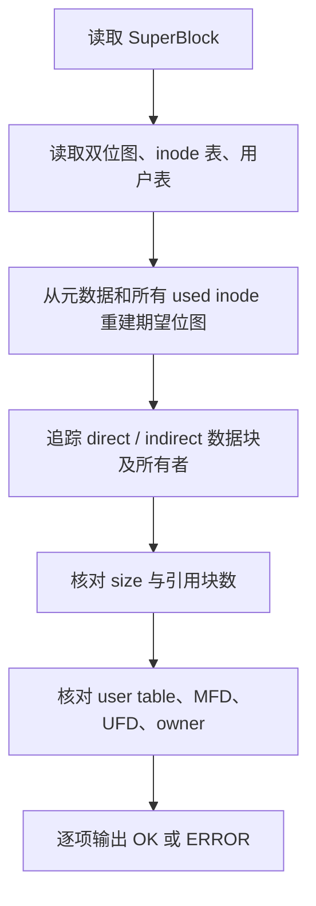

# FSCK 与用户管理

FSCK 和 USERADD 都要接触多种磁盘结构，但方向相反。FSCK 只读扫描并判断它们是否互相吻合；USERADD/PASSWD 是受权限控制的写路径，必须让用户表、MFD、UFD、inode 和位图保持一致。

## FSCK 不是一句固定的 OK

`FileSystem::check_consistency` 返回 `FsckReport`，里面有总状态和若干 `FsckCheck`。正常镜像当前输出六项：

```text
FSCK OK checks=6
OK superblock: magic/version/geometry ok
OK inode bitmap: inode bitmap matches used inode records
OK block bitmap: block bitmap matches metadata and reachable blocks
OK file sizes: file sizes match referenced data-block counts
OK user table: user table, UFD pointers, and MFD entries match
OK directories: MFD/UFD entries point at valid inodes
```

它的做法不是“位图看起来有值就算通过”，而是从真实可达结构重新算一份期望状态。



扫描还会发现越界块、同一物理块被两个 inode 重复引用、未使用 inode 仍残留块指针、目录误用间接块、文件大小与数据块数不符、重复用户名或 uid、用户 UFD owner 不匹配、MFD 缺失用户入口、UFD 指向无效或他人 inode 等问题。

## 两种真实故障注入

原有 `test_fsck_reports_ok_and_detects_corruption` 先写一个真实文件，然后直接编辑 `.img`，把该文件第一个数据块在 block bitmap 中的占用位清零。文件 inode 仍然引用这个块，FSCK 重建出的期望位图与磁盘位图不同，于是得到：

```text
FSCK ERROR checks=6
ERROR block bitmap: block bitmap mismatch at block ...
```

新增 `test_fsck_finds_inode_bitmap_corruption` 做另一种破坏：普通文件 inode 的 `used=1` 保持不变，却清掉 inode bitmap 中对应位。FSCK 必须报告：

```text
ERROR inode bitmap: inode bitmap mismatch at inode ...
```

两种损坏路径相互独立，可以排除测试只匹配一条固定错误字符串。FinalShell Step 09 已准备好 block bitmap 损坏命令，但在远端实跑输出补回前仍标记为待执行，不把预期文本冒充 Linux 证据。

## 为什么 FSCK 只读

发现损坏和自动修复是两件风险不同的事。当前 `check_consistency` 只读取镜像并构造报告，不写超级块、不改位图、不分配或释放块。课程演示可以先运行干净镜像得到 OK，再手工破坏位图得到 ERROR；如果 FSCK 自动把位图改回去，反而难以判断它有没有理解真正的可达关系。

这也是项目明确披露的边界：它不是生产级 `fsck`，不处理修复顺序、孤儿 inode 恢复、日志回放和崩溃中断后的二次一致性。

## USERADD 为什么比改一行用户表复杂

root 创建 Carol 时需要同时建立身份和目录：

```text
LOGIN root root
USERADD carol carol123
OK useradd carol
```

内部会先确认用户表有空槽、用户名未重复、至少有一个 UFD 数据块和一个 UFD inode 可用。然后它分配新 UFD，写用户记录，在 MFD 写同名入口，更新用户数、空闲计数和双位图。任何一步的前置资源不足都要在真正写入前返回错误。

普通用户执行 USERADD 会立即得到 `ERR USERADD requires root`。这条检查在进入用户表修改前完成。

## PASSWD 怎样限制目标用户

命令有两种写法：

```text
PASSWD new-password              当前普通用户修改自己
PASSWD carol new-password        root 修改指定用户
```

普通用户指定别人时返回 `ERR permission denied`。成功后只更新目标 `UserRecordDisk.password_hash` 并回写用户表。测试会关闭并重新打开镜像，要求旧密码不能登录、新密码可以登录；如果只是修改当前命令处理器内存，这项测试会失败。

## FSCK 与用户管理怎样互相验证

用户管理完成后再执行 FSCK，用户表检查会核对：

- `sb.user_count` 是否等于实际 used 用户数。
- 用户名和 uid 是否重复。
- `ufd_inode` 是否指向 used 的目录 inode。
- UFD inode 的 owner_uid 是否等于用户 uid。
- MFD 是否存在同名入口并指向同一个 UFD inode。
- UFD 中普通文件是否属于该用户。

因此 `USERADD` 不能只做到“Carol 能登录”。如果忘记写 MFD，登录也许仍成功，但 FSCK 的 user table 检查会失败；如果忘记设 UFD owner，目录检查同样会报错。

答辩时可以用一句话概括：用户管理负责建立正确关系，FSCK 从另一条只读路径重新证明这些关系存在。
