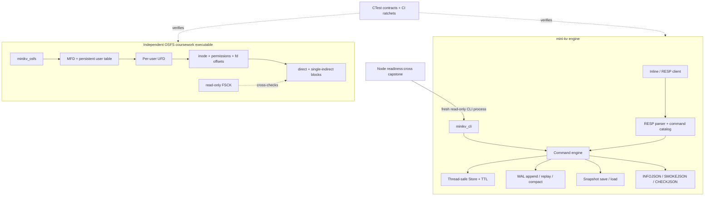

# mini-kv

[](https://github.com/wul012/mini_kv/actions/workflows/ci.yml)
[](docs/TESTING.md)
[](docs/project-docs-honesty-matrix.md)
[](.github/workflows/ci.yml)

mini-kv 是一个从零实现的 C++20 键值存储：线程安全内存 Store、WAL 崩溃恢复、Snapshot、RESP/TCP 和可机器读取的运行证据都在同一仓库内闭环。仓库还包含一个彼此独立的 OSFS 课程设计子系统，用二进制磁盘镜像展示 MFD/UFD 二级目录、inode、权限、文件描述符、一级间接块和只读 FSCK。这里的质量主张不靠版本数量或截图成立，而由 CTest、覆盖率下限、精确 census、尺寸 ratchet 和三平台 CI 机械约束。四项目 capstone 已由 Node 以真实 `minikv_cli` 新进程读取 `SMOKEJSON` 与 `CHECKJSON`，验证过程保持只读且不授予执行权。

mini-kv is a from-scratch C++20 key-value engine with a thread-safe in-memory store, crash-recoverable WAL, snapshots, RESP/TCP transport, and machine-readable runtime evidence. It also ships an independent OSFS teaching filesystem that exposes its disk layout and consistency mechanisms instead of hiding them behind mocks. Every headline metric below points to a committed check or evidence record, and the cross-project claim is limited to the reviewed, env-gated, read-only capstone.

**Maturity: single-project validation + verified read-only cross-project integration (env-gated, single machine, no execution authority).**

## 30 秒看懂

| 维度 | 当前事实 | 机械证据 |
|---|---|---|
| 构建与测试 | **354 registered CTest tests**；普通构建把 342 个链接型测试收口到 8 个稳定 runner，instrumented lane 保留一测试一可执行文件；Linux、macOS、Windows、sanitizer、coverage、format、archive 共七条 CI job | [`MinikvTesting.cmake`](cmake/MinikvTesting.cmake)、[testing guide](docs/TESTING.md)、[CI workflow](.github/workflows/ci.yml) |
| 核心覆盖率 | v1658 reviewed baseline 为 2345 行、执行 2122 行、90%；当前 filter 另含 atomic-file writer，CI 继续强制 **90% floor** | [`docs/minikv-track-final-evidence.md`](docs/minikv-track-final-evidence.md)、[`ci.yml`](.github/workflows/ci.yml) |
| 源码体积 | `src/` 与 `include/` 每个源码文件不超过 800 个非空物理行；仅保留一个具名 registry 豁免 | [`check_minikv_track_final_evidence.cmake`](cmake/check_minikv_track_final_evidence.cmake) |
| Receipt 结构 | 28 个 receipt 源文件中，**27 builder-backed / 0 pending / 1 named no-formatter waiver**；两轮共享布尔 profile 把手工字段追加从 1056 降到 613，本地 digest 转发器从 6 收口到 1，并由精确棘轮保护 | [`check_receipt_builder_census.cmake`](cmake/check_receipt_builder_census.cmake)、[`docs/receipts-consolidation-note.md`](docs/receipts-consolidation-note.md) |
| 优雅债台账 | 存量长文件名 735、公共头文件可见长标识符 883、CMake 测试 target 长名 277；baseline 只减不增，测试对象路径风险分数上限为 197 | [`config/elegance-name-baseline.txt`](config/elegance-name-baseline.txt)、[`config/test-target-name-baseline.txt`](config/test-target-name-baseline.txt)、[`test_architecture_tests.cpp`](tests/test_architecture_tests.cpp) |
| OSFS 课程设计 | 磁盘镜像、持久化用户、MFD/UFD、fd 偏移、权限、直接块与一级间接块、FSCK 检错、USERADD/PASSWD | [`OSFS课程设计通俗教程/`](OSFS课程设计通俗教程/README.md)、[`tests/osfs_tests.cpp`](tests/osfs_tests.cpp)、[`tests/osfs_resilience_tests.cpp`](tests/osfs_resilience_tests.cpp) |
| 四项目验证 | Node 启动真实 Java、执行真实 mini-kv CLI、读取 aiproj 登记产物；C1-C4 最终态复跑均通过 | [program-close evidence](https://github.com/wul012/nodeproj/blob/master/docs/plans/production-excellence-final-acceptance.md) |

## 架构



两条子系统共享 CMake/CTest 工程，但不共享存储职责：OSFS 不是 KV 的持久化后端，KV 也不会借 OSFS 绕过 WAL、Snapshot 或权限边界。

## Quickstart

要求 CMake 3.20+、C++20 编译器；核心工程不依赖第三方运行库。

```bash
cmake -S . -B build -DCMAKE_BUILD_TYPE=Debug
cmake --build build --config Debug --parallel 4
ctest --test-dir build -C Debug --output-on-failure --timeout 120
```

普通配置默认保留 354 个 CTest 名称和一例一进程隔离，但只链接 8 个共享 runner；若需要直接生成每个旧测试可执行文件，可配置 `-DMINIKV_BUNDLE_TESTS=OFF`。Coverage 与 sanitizer 在新构建目录会自动选择旧拓扑；复用曾缓存 bundle ON 的目录或显式同时开启两者会在配置阶段失败，此时应显式关闭 bundle 或使用独立 instrumented build 目录。

执行一个不写 Store、不触碰 WAL 的 CLI smoke：

```bash
printf 'SMOKEJSON\nCHECKJSON GET demo\nHEALTH\nQUIT\n' | ./build/minikv_cli
```

PowerShell / Visual Studio 多配置生成器下，可执行文件通常位于 `build\Debug\minikv_cli.exe`：

```powershell
"SMOKEJSON`nCHECKJSON GET demo`nHEALTH`nQUIT" | .\build\Debug\minikv_cli.exe
```

`SMOKEJSON` 汇总只读运行状态；`CHECKJSON GET demo` 只解释命令边界，不执行 `GET`。要观察真实写入与恢复，可在临时 WAL 上运行 `SET`、重启 CLI，再读取同一 key；完整流程见 [`docs/CAPABILITY-SNAPSHOT.md`](docs/CAPABILITY-SNAPSHOT.md)。

### 复现质量门

```bash
ctest --test-dir build -C Debug \
  -R 'minikv_track_final_evidence_contract|project_docs_honesty_contract|receipt_builder_census_contract|elegance_name_census_contract' \
  --output-on-failure
```

```bash
python scripts/archive_inventory.py --budget-mib 8 --strict
```

第一条会在覆盖率配置、文档主张、receipt owner census、613 个手工字段追加、1 个 canonical digest 包装器、命名 baseline 或源码尺寸规则漂移时失败；第二条只清点路径稳定的历史归档，不移动或压缩证据。

## 运行入口

| 入口 | 用途 | 关键边界 |
|---|---|---|
| `minikv_cli [wal_path]` | 单进程命令行、WAL 重放与维护 | 未传 WAL 时仅内存；`LOAD`/`COMPACT` 是显式管理命令 |
| `minikv_server [port] [host] [wal_path]` | Inline 与 RESP-over-TCP | 默认绑定 `127.0.0.1`；远程暴露必须自行提供认证、TLS 与防火墙 |
| `minikv_client host port` | 交互式 TCP 客户端 | 支持历史、补全、超时和重试，不是安全代理 |
| `minikv_benchmark --evidence-json` | 本地轻量 benchmark | 只操作临时内存 Store，不启用 WAL 或网络 |
| `minikv_osfs --disk image [--format]` | OSFS 课程设计 shell | 独立磁盘镜像；教学权限与哈希模型，不是生产文件系统 |

常用 KV 命令包括 `SET`、`GET`、`DEL`、`EXPIRE`、`TTL`、`SAVE`、`LOAD`、`COMPACT`、`WALINFO`、`STATSJSON`、`SMOKEJSON`、`COMMANDSJSON`、`EXPLAINJSON` 和 `CHECKJSON`。命令分类、响应字段、WAL 顺序、TCP 参数与 RESP 限制集中在 [`docs/CAPABILITY-SNAPSHOT.md`](docs/CAPABILITY-SNAPSHOT.md)，测试入口见 [`docs/TESTING.md`](docs/TESTING.md)。

## 证据地图

| 想核实什么 | 从这里开始 |
|---|---|
| E1-E10、90% floor、唯一源码尺寸豁免、外部 Stage-1 PASS | [`docs/minikv-track-final-evidence.md`](docs/minikv-track-final-evidence.md) |
| 当前能力、命令字段与持久化细节 | [`docs/CAPABILITY-SNAPSHOT.md`](docs/CAPABILITY-SNAPSHOT.md) |
| CI lane、sanitizer、coverage 范围与本地测试方式 | [`docs/TESTING.md`](docs/TESTING.md) |
| 网络、密钥、输入与部署边界 | [`docs/SECURITY.md`](docs/SECURITY.md) |
| receipt builder 迁移、字节等价和 27/0/1 census | [`docs/receipts-consolidation-note.md`](docs/receipts-consolidation-note.md) |
| 四项目最终态只读 capstone | [Node program close](https://github.com/wul012/nodeproj/blob/master/docs/plans/production-excellence-final-acceptance.md) |
| OSFS 从命令到磁盘的通俗机制 | [`OSFS课程设计通俗教程/README.md`](OSFS课程设计通俗教程/README.md) |
| OSFS 报告、需求矩阵与 Linux/FinalShell 实跑 | [`课程设计交付/v1636-osfs-final/`](课程设计交付/v1636-osfs-final/README.md)、[`finalshell-分段演示记录/`](课程设计交付/v1636-osfs-final/finalshell-分段演示记录/README.md) |
| OSFS 三阶段工作约束 | [`v1631 completion`](治理计划/v1631-osfs-coursework-completion-brief.md)、[`v1634 capacity`](治理计划/v1634-osfs-capacity-extension-brief.md)、[`v1663 teaching evidence`](治理计划/v1663-osfs-teaching-evidence.md) |
| 历史版本与归档保留 | [`docs/CHANGELOG.md`](docs/CHANGELOG.md)、[`docs/archive-retention-index.md`](docs/archive-retention-index.md) |

## 边界

- mini-kv 包含真实的写命令；“只读、无执行权”描述的是 `INFOJSON`/`SMOKEJSON`/`CHECKJSON` 证据面和跨项目 capstone，不是把整个 KV 引擎说成只读。
- TCP server 默认只监听 loopback，但协议本身没有认证或 TLS。它是学习与工程验证系统，**not a hardened production database**，不要直接暴露到不受信任网络。
- OSFS 使用单镜像、单 MFD、每用户 UFD、直接块加一级间接块、只读 FSCK 和教学级密码哈希；它不承诺并发挂载、日志文件系统、自动修复或生产级密码保护。
- Node 可在显式 `INTEGRATION_LIVE=1` 窗口中启动一个新的 CLI 进程并读取证据，但不能调用 mini-kv 的写、恢复、压缩或自动启动能力；mini-kv 也不拥有订单、审批、发布或审计 authority。
- CMake 工程版本保留为 `0.102.0`，因为冻结的运行 receipt 仍引用 v102 语义；Git tag `vNNNN` 表示仓库交付节奏，两者不是同一个版本轴。

## 最近版本

完整历史见 [`docs/CHANGELOG.md`](docs/CHANGELOG.md)。README 只保留对当前展示面有直接解释力的四项：

- v1671: 保留 354 个 CTest 名称、顺序和一例一进程语义，把 342 个普通测试的最终链接稳定收口到 8 个 runner；核心 touch 后 executable link 347→13、增量时间 56.87→21.36 秒，全部测试 exe 由 345 个/3,983,351,060 字节降到 11 个/415,219,566 字节，coverage/sanitizer 与显式 legacy 配置仍使用一测试一 exe。
- v1672: 把 `command.cpp` 中 62 个同构无参数只读 evidence 分支改为编译期固定表，旧文件从 732 降到 258 个非空行；迁移前后 159 行、2,093,273 字节真实 CLI 输出 SHA-256 相同，并让 bundled、legacy、standalone 测试在 Release 下也显式启用断言。
- v1670: 以私有 `AtomicFileWriter` 统一 WAL compact 与 Snapshot save 的同目录临时文件、flush/close、平台替换和失败清理；新增成功、放弃、坏流、父目录、replace 失败和 owner 集成证据，第 354 个 CTest 机械拒绝重复实现回流。
- v1669: 将三份连续 approval receipt 的 201 个重复字段追加改为六段具名 profile，同时删除五个一行式 digest 转发器；精确门收紧到 613/1，四组上下界故障注入、57 项 receipt 组合测试与原有字节 oracle 全部通过。
- v1668: 为 receipt builder 增加有序 `BooleanField` profile，把四个重复边界族的 242 次命令式追加改为数据声明；新增 814 个手工追加与 6 个本地 digest 包装器的精确 shrink-only 门，增长和 baseline 未及时收紧都会失败。

维护者入口：[`START_HERE.md`](START_HERE.md) · [`docs/production-excellence-progress.md`](docs/production-excellence-progress.md) · [`治理计划/README.md`](治理计划/README.md)
