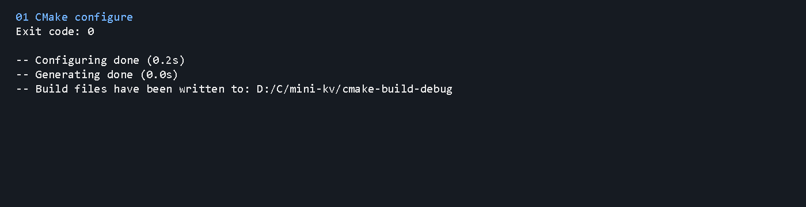
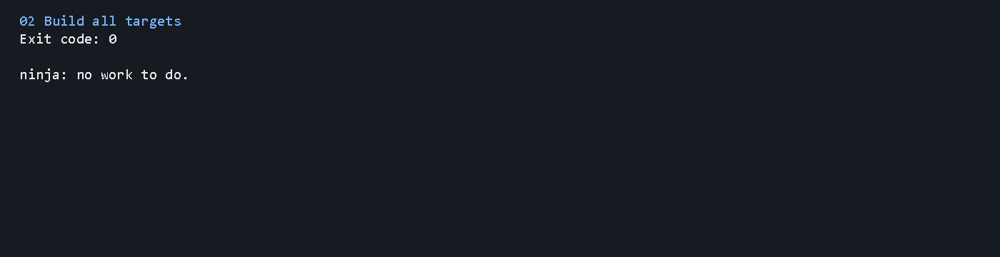
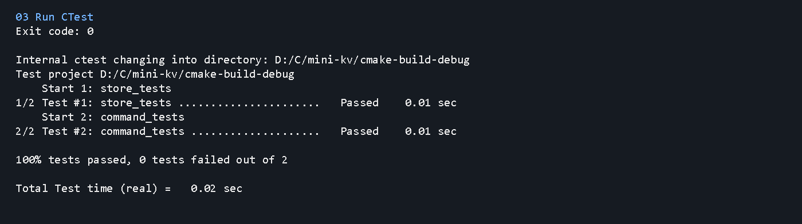
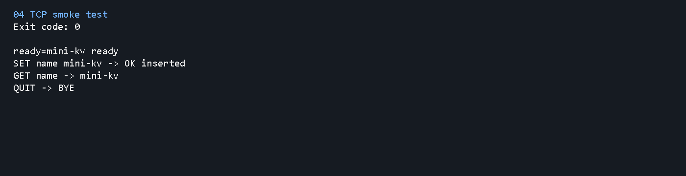

# mini-kv 第一版命令结果归档

## 归档范围

这一版把项目从本地 CLI 雏形推进到第一版可运行 KV 服务，包含：

- CMake 构建配置
- 内存 KV Store
- 公共命令处理层 `CommandProcessor`
- CLI 程序 `minikv_cli`
- TCP 服务端 `minikv_server`
- Store 和命令处理测试
- TCP 实连 smoke test

## 核心执行流程

```text
cmake configure
 -> build all targets
 -> ctest
 -> 启动 minikv_server
 -> TCP 客户端发送 SET/GET/QUIT
 -> 停止服务端
```

## 截图说明

### 01 CMake configure



这一步重新生成 `cmake-build-debug` 构建目录。结果为 `Exit code: 0`，说明 CMake 配置阶段成功，项目文件能被当前 CLion 自带 CMake 正确识别。

### 02 Build all targets



这一步构建所有目标，包括：

- `minikv`
- `minikv_cli`
- `minikv_server`
- `minikv_store_tests`
- `minikv_command_tests`

结果为 `Exit code: 0`，说明第一版代码能通过 GCC 13.1.0 编译和链接。

### 03 Run CTest



这一步运行 CTest。结果显示 2 个测试全部通过：

- `store_tests`
- `command_tests`

说明内存存储和命令解析的基础行为目前是稳定的。

### 04 TCP smoke test



这一步启动 `minikv_server`，通过 TCP 客户端连接 `127.0.0.1:6381`，发送：

```text
SET name mini-kv
GET name
QUIT
```

结果返回：

```text
ready=mini-kv ready
SET name mini-kv -> OK inserted
GET name -> mini-kv
QUIT -> BYE
```

说明 TCP 服务端能接受连接、执行命令并返回响应。

## 当前结论

第一版已经达到“可构建、可测试、可通过 TCP 访问”的状态。它还是内存数据库，服务退出后数据会丢失；下一版适合继续做 WAL 持久化、TTL 或独立客户端。

## 清理记录

- TCP smoke test 启动的 `minikv_server.exe` 已停止。
- 没有保留临时脚本。
- 没有发现残留 `tmp`、`.pytest_cache`、`__pycache__`、`playwright-report` 或 `test-output` 目录。
