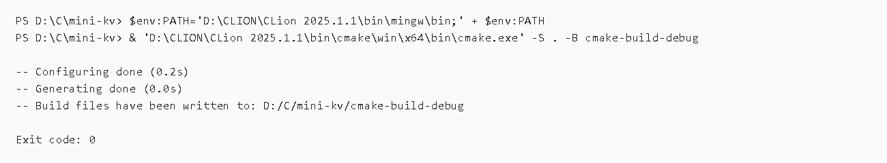
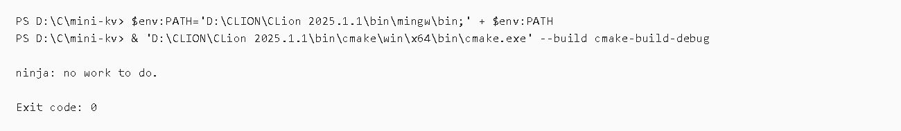
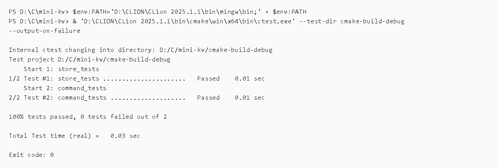
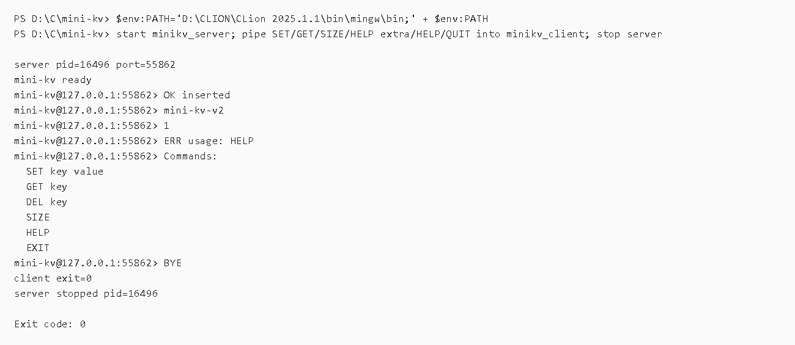

# mini-kv 第二版命令结果归档

## 归档范围

第二版补齐 roadmap 中的“小客户端程序”：新增 `minikv_client`，用于连接正在运行的 `minikv_server`，通过 TCP 发送一行一条命令并打印服务端响应。

本版主要变更：

- 新增 `src/client_main.cpp`
- 新增 CMake 目标 `minikv_client`
- 项目版本从 `0.1.0` 提升到 `0.2.0`
- README 更新为 Version 2，并补充 TCP client 运行方式

## 核心执行流程

```text
cmake configure
 -> build all targets
 -> ctest
 -> start minikv_server
 -> pipe commands into minikv_client
 -> stop minikv_server
```

## 截图说明

### 01 CMake configure



使用 CLion 捆绑 CMake 重新配置 `cmake-build-debug`。结果为 `Exit code: 0`，说明新增的 `minikv_client` 目标已被 CMake 正确识别，构建文件生成成功。

### 02 Build all targets



执行全量构建。结果为 `Exit code: 0`，本次归档时 Ninja 显示 `no work to do`，说明当前构建产物已经是最新状态，包含第二版新增的 `minikv_client.exe`。

### 03 Run CTest



执行 CTest。结果显示 2 个既有测试全部通过：

- `store_tests`
- `command_tests`

说明第二版新增客户端没有破坏核心存储和命令处理行为。

### 04 Client smoke test



启动 `minikv_server` 到本机空闲端口，通过第二版新增的 `minikv_client` 连接服务端，并发送：

```text
SET name mini-kv-v2
GET name
SIZE
HELP extra
HELP
QUIT
```

结果返回：

```text
mini-kv ready
OK inserted
mini-kv-v2
1
ERR usage: HELP
Commands: ...
BYE
```

说明新增客户端能完成连接、发送命令、读取普通响应、处理 `HELP extra` 这类单行错误响应、读取 `HELP` 多行响应，并能在 `QUIT` 后正常退出。验证结束后，本次启动的 `minikv_server.exe` 已停止。

## 当前结论

第二版开发完成：项目现在除了本地内存 CLI 和 TCP 服务端，也具备独立 TCP 客户端。当前代码可以配置、构建、测试，并通过真实客户端-服务端 smoke test。

## 清理记录

- Client smoke test 启动的 `minikv_server.exe` 已停止。
- 用于生成截图的临时文本日志会在最终清理阶段删除。
- 未保留临时服务端 stdout/stderr 文件。
