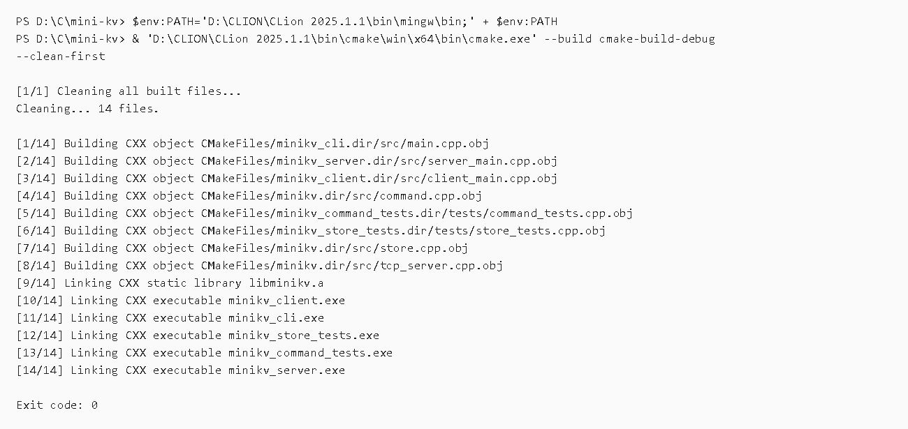
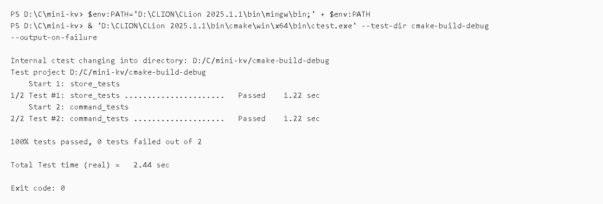
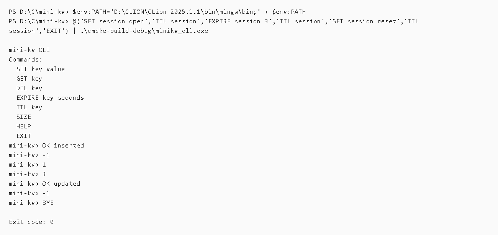
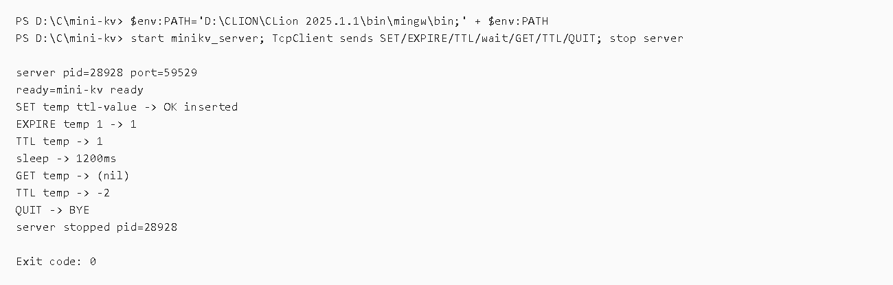

# mini-kv 第三版命令结果归档

## 归档范围

第三版完成 TTL 支持，新增命令：

- `EXPIRE key seconds`
- `TTL key`

本版主要变更：

- `Store` 从普通 `string -> string` 存储升级为带可选过期时间的 Entry。
- `GET`、`CONTAINS`、`SIZE`、`SNAPSHOT` 等读取路径会懒清理过期 key。
- `SET` 会替换 value 并清除旧 TTL。
- `CommandProcessor` 新增 `EXPIRE` 和 `TTL` 命令。
- README 更新为 Version 3，Roadmap 移除 TTL，下一步变为 WAL persistence。

## 核心执行流程

```text
cmake configure
 -> clean build all targets
 -> ctest
 -> CLI TTL smoke test
 -> start minikv_server
 -> TCP TTL smoke test
 -> stop minikv_server
```

## 截图说明

### 01 CMake configure


使用 CLion 捆绑 CMake 重新配置 `cmake-build-debug`。结果为 `Exit code: 0`，说明第三版的 CMake 配置生成成功。

### 02 Build all targets



使用 `--clean-first` 清理旧构建产物后重新构建所有目标。结果为 `Exit code: 0`，说明第三版代码可以完整编译和链接，包含：

- `minikv`
- `minikv_cli`
- `minikv_server`
- `minikv_client`
- `minikv_store_tests`
- `minikv_command_tests`

### 03 Run CTest



执行 CTest。结果显示 2 个测试全部通过：

- `store_tests`
- `command_tests`

测试覆盖了 TTL 的基础行为，包括设置过期时间、过期后读取为空、`TTL` 缺失返回语义，以及 `SET` 重置 TTL。

### 04 CLI TTL smoke test



通过 `minikv_cli.exe` 验证 TTL 命令可用：

```text
SET session open
TTL session
EXPIRE session 3
TTL session
SET session reset
TTL session
EXIT
```

结果显示无 TTL 的 key 返回 `-1`，设置 TTL 后返回剩余秒数，重新 `SET` 后 TTL 再次变为 `-1`。

### 05 TCP TTL smoke test



启动 `minikv_server` 到本机空闲端口，通过 TCP 客户端发送：

```text
SET temp ttl-value
EXPIRE temp 1
TTL temp
等待 1200ms
GET temp
TTL temp
QUIT
```

结果显示：

```text
EXPIRE temp 1 -> 1
TTL temp -> 1
GET temp -> (nil)
TTL temp -> -2
```

说明 key 到期后会被视为不存在。验证结束后，本次启动的 `minikv_server.exe` 已停止。

## 当前结论

第三版开发完成：项目现在支持秒级 TTL，CLI、TCP server 和 TCP client 均可使用 `EXPIRE` / `TTL` 命令。构建、单元测试、CLI smoke test 和 TCP smoke test 均通过。

## 清理记录

- TCP TTL smoke test 启动的 `minikv_server.exe` 已停止。
- 临时服务端 stdout/stderr 文件已删除。
- 用于生成截图的临时文本日志会在最终清理阶段删除。
