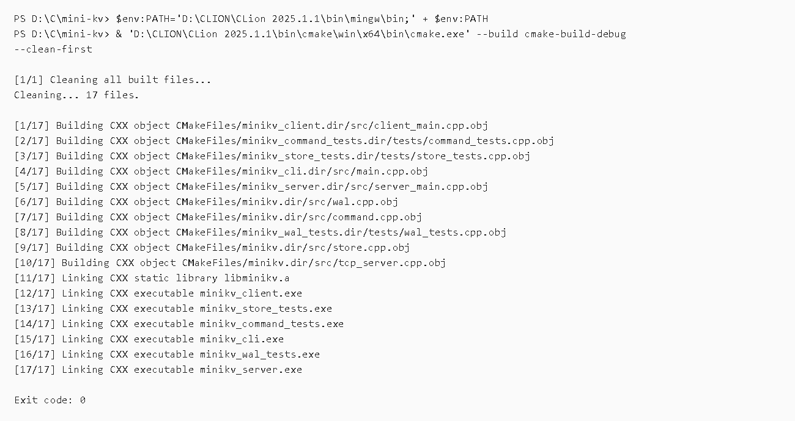
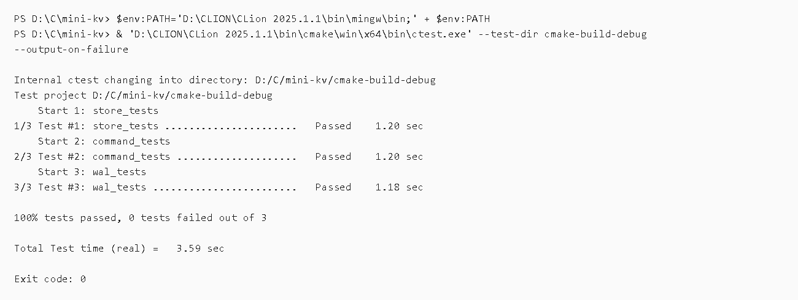
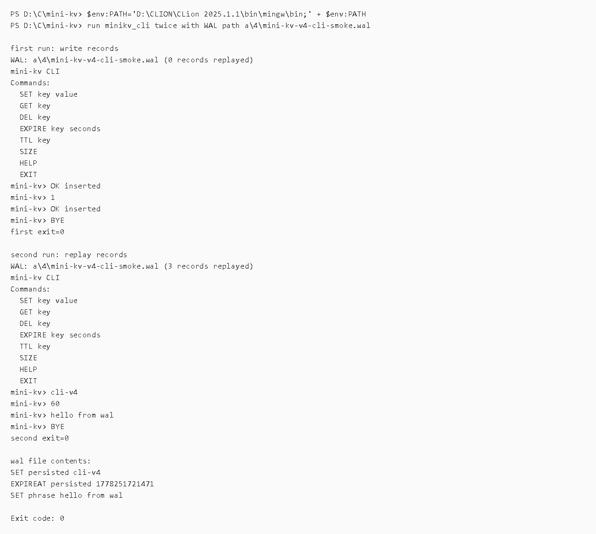
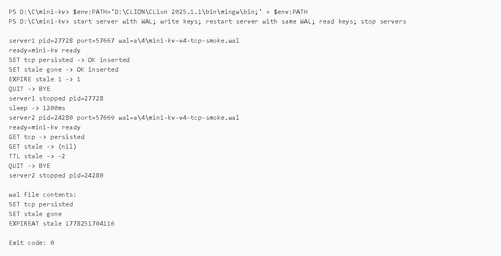

# mini-kv 第四版命令结果归档

## 归档范围

第四版完成 WAL persistence，新增 `WriteAheadLog` 模块，并让 CLI 和 TCP server 都可以通过传入 WAL 路径启用持久化。

本版主要变更：

- 新增 `include/minikv/wal.hpp` 和 `src/wal.cpp`。
- `CommandProcessor` 支持可选 `WriteAheadLog`，成功写命令会先追加 WAL 再修改内存。
- WAL 记录 `SET`、`DEL` 和内部绝对过期记录 `EXPIREAT`。
- CLI 支持 `minikv_cli.exe [wal_path]`。
- Server 支持 `minikv_server.exe [port] [host] [wal_path]`。
- 新增 `tests/wal_tests.cpp` 和 CTest 目标 `wal_tests`。
- README 更新为 Version 4，Roadmap 推进到 snapshots。

## 核心执行流程

```text
cmake configure
 -> clean build all targets
 -> ctest
 -> CLI WAL smoke test
 -> TCP server WAL restart smoke test
```

## 截图说明

### 01 CMake configure


使用 CLion 捆绑 CMake 重新配置 `cmake-build-debug`。结果为 `Exit code: 0`，说明新增 `wal.cpp` 和 `wal_tests` 后配置生成成功。

### 02 Build all targets



使用 `--clean-first` 清理旧构建产物后重新构建所有目标。结果为 `Exit code: 0`，说明第四版所有目标均可完整编译和链接，包含新增的 `minikv_wal_tests`。

### 03 Run CTest



执行 CTest。结果显示 3 个测试全部通过：

- `store_tests`
- `command_tests`
- `wal_tests`

其中 `wal_tests` 验证 WAL 能记录 `SET`、`DEL`、`EXPIRE`，并在新 Store 中 replay 恢复数据；已经过期的绝对过期记录不会让 key 复活。

### 04 CLI WAL smoke test



第一次用 `minikv_cli.exe a\4\mini-kv-v4-cli-smoke.wal` 写入：

```text
SET persisted cli-v4
EXPIRE persisted 60
SET phrase hello from wal
```

第二次用同一个 WAL 路径启动 CLI，显示 replay 了 3 条记录，并能读取：

```text
GET persisted -> cli-v4
TTL persisted -> 60
GET phrase -> hello from wal
```

WAL 文件内容包含：

```text
SET persisted cli-v4
EXPIREAT persisted ...
SET phrase hello from wal
```

说明 CLI WAL 写入和启动恢复均可用。

### 05 TCP WAL smoke test



第一次启动 `minikv_server` 并使用 WAL 路径 `a\4\mini-kv-v4-tcp-smoke.wal`，写入：

```text
SET tcp persisted
SET stale gone
EXPIRE stale 1
```

停止服务端，等待 1200ms 后使用同一个 WAL 路径重启服务端。第二次连接验证：

```text
GET tcp -> persisted
GET stale -> (nil)
TTL stale -> -2
```

说明 WAL replay 能恢复未过期数据，也能根据绝对 `EXPIREAT` 让已经过期的 key 保持不存在。两次 smoke test 启动的服务端均已停止。

## 当前结论

第四版开发完成：mini-kv 现在支持可选 WAL 持久化。未传 WAL 路径时仍保持纯内存模式；传入 WAL 路径时，CLI 和 TCP server 会启动时 replay 日志，并在运行时追加成功的写命令。

## 清理记录

- TCP WAL smoke test 启动的两个 `minikv_server.exe` 进程均已停止。
- 临时 server stdout/stderr 文件已删除。
- 用于 smoke test 的临时 WAL 文件已删除。
- 用于生成截图的临时文本日志已删除。
