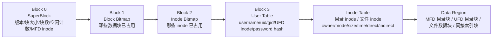
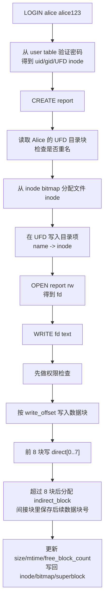
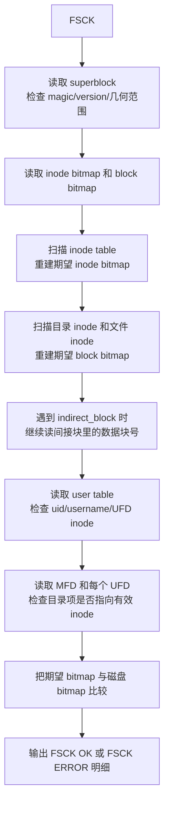

# 答辩速记与图解

## 一句话版本

本项目把一个二进制 `.img` 文件当作虚拟磁盘，在里面实现了 superblock、block bitmap、inode bitmap、用户表、inode 表、MFD/UFD 两级目录、文件权限、文件描述符位移、直接块加一级间接块，以及只读 FSCK 检查；外部通过 `minikv_osfs` 输入类 Linux 文件系统命令，输出目录、文件内容、权限结果和一致性诊断。

## 磁盘布局可手画图

讲这张图时不要只背名字。最稳的说法是：superblock 负责告诉程序“磁盘怎么切”；两个 bitmap 负责分配和回收；user table 把用户名和 UFD inode 绑定起来；inode table 保存文件和目录的元信息；data region 里才是真正的目录项和文件内容。

## CREATE + WRITE 流程可手画图

答辩时如果老师问“一次写文件到底改了哪里”，就按这条线讲：认证、定位 UFD、目录项、inode、数据块、bitmap、superblock。这样比只说“调用 WRITE 命令”扎实得多。

## FSCK 流程可手画图

关键点：FSCK 不是修复器，是只读诊断器。它的价值在于把“磁盘上声称占用的块”和“从目录、inode、间接块实际能走到的块”重新算一遍，然后比较两边是否一致。

## 30 秒开场回答

老师如果先问“你这个项目做了什么”，可以这样答：

> 我做的是一个教学版二级文件系统。它不是在内存里模拟几个命令，而是把一个 `.img` 文件当成磁盘，在里面固定存放超级块、位图、用户表、inode 表和数据区。登录后，每个用户通过 user table 找到自己的 UFD；创建文件会分配 inode 并写入当前 UFD；读写文件会通过 inode 的 direct 和 indirect block 找到真实数据块；FSCK 会重新扫描这些结构，检查 bitmap、inode、目录和用户表是否一致。v1636 还补了 Linux 主机运行证据，所以现在既能解释机制，也能现场复现。

## 演示顺序速记

1. `WHOAMI` 和未登录 `CREATE`：证明命令入口受登录状态控制。
2. `LOGIN alice alice123`：证明用户表认证。
3. Alice `CREATE/OPEN/WRITE/READ/SEEK/TELL`：证明 fd 位移和读写。
4. Alice 写 `bigfile` 超过 4096 字节：证明一级间接块真实参与 I/O。
5. `FSCK`：证明干净镜像结构一致。
6. Bob 登录后看不到 Alice 文件，且打不开 `0600` 文件：证明 UFD 隔离和权限位。
7. Bob `USERADD` 被拒，root `USERADD/PASSWD` 成功：证明用户管理和 root 权限。
8. Carol 用新密码登录并创建自己的文件：证明用户表和新 UFD 持久化。
9. 去掉 `--format` 重开镜像：证明所有状态不是临时内存。

## 最容易被问住的三点

第一，老师可能问“是不是只有一个目录，用 owner 过滤假装多用户”。回答时要说清：MFD、root UFD、Alice UFD、Bob UFD、Carol UFD 是不同 inode 和不同目录数据块，user table 保存 UFD inode，MFD 也有对应目录项。

第二，老师可能问“indirect block 是不是只加了字段”。回答时要说清：超过 8 个 512 字节直接块后，inode 的 `indirect_block` 指向一个索引块，索引块里存后续数据块号；演示里 4291 字节文件跨过 4096 字节边界后还能读回 `INDIRECT-BEGIN`。

第三，老师可能问“FSCK 是不是只打印 OK”。回答时要说清：它会扫描 superblock、双 bitmap、inode、用户表、MFD/UFD、直接块和间接块，重新构造期望状态；独立验证里翻转过真实数据块对应的 block bitmap 位，FSCK 能报错。

