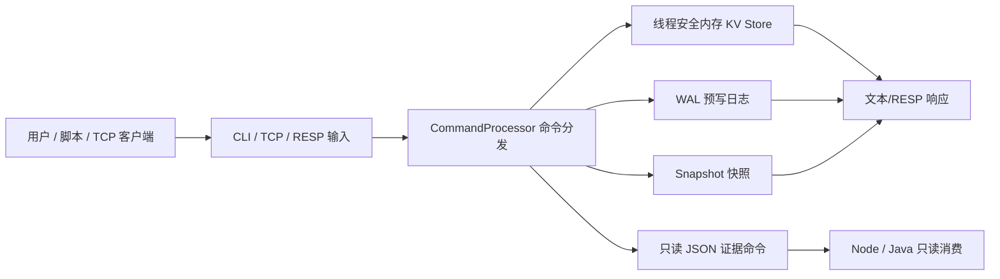
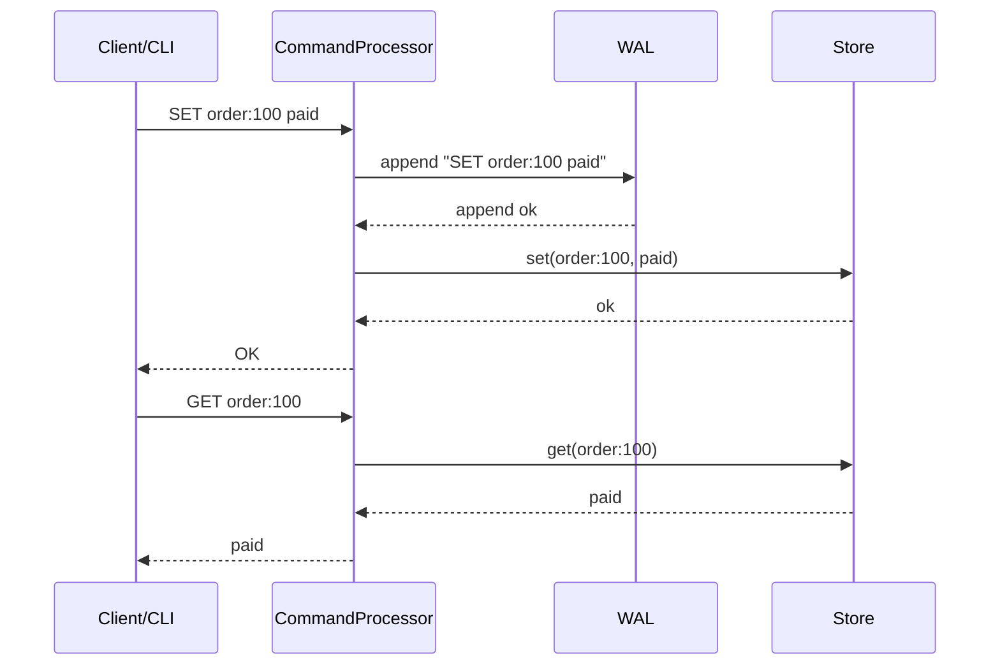
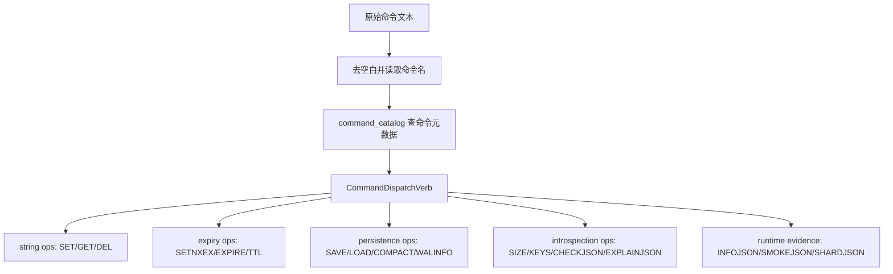

# mini-kv 项目机制与价值说明

这份说明用通俗方式解释 mini-kv 到底在做什么、有价值的地方在哪里、每一步输入和输出是什么，以及它内部如何运行。

## 一句话说明

mini-kv 是一个用 C++20 写的小型 Redis，同时也是一个“可证明边界”的证据机器。

它不只是练习 `SET/GET`，而是在做一套工程化链路：数据怎么进来、怎么存、怎么落 WAL、怎么恢复、怎么通过 TCP/RESP 对外服务、怎么用 JSON 证据证明“我只是只读检查，没有偷偷执行危险操作”。



## 它到底在做什么

第一，做一个小型 KV 数据库。

它支持 `SET`、`GET`、`DEL`、`EXPIRE`、`TTL`、`KEYS`、`PING` 等基础命令。用户可以通过 CLI 输入命令，也可以通过 TCP 客户端或 RESP 协议访问它。

第二，做持久化和恢复。

写命令可以进入 WAL，也就是 write-ahead log。正常写入时，命令先追加到 WAL，再修改内存里的 Store。重启时，mini-kv 可以 replay WAL，把数据恢复回来。它也支持 `SAVE` 和 `LOAD` 这样的 snapshot 快照能力。

第三，做 TCP 服务。

它不只是一个本地命令行工具，也能启动 `minikv_server`，接受 TCP 连接。内置 client 可以连接它，外部 Redis 风格客户端也能通过 RESP 请求和它交互。

第四，做运行时观测。

它有 `INFOJSON`、`STATSJSON`、`HEALTH`、`WALINFO`、`COMMANDSJSON` 等命令，用来输出版本、协议、WAL 状态、命令统计、连接统计、健康状态、支持命令列表。

第五，做边界证明。

它有 `SMOKEJSON`、`CHECKJSON`、`SHARDJSON`、一系列 `SHARDROUTE...JSON` 和 credential resolver non-participation receipt 命令。这些命令的重点不是执行生产动作，而是证明：

- mini-kv 可以被 Node/Java 只读消费。
- mini-kv 不是 Java 订单权威。
- mini-kv 不读取生产 credential。
- mini-kv 不自动启动 Node 或 Java。
- mini-kv 不执行 restore/load/compact/SETNXEX 等危险生产动作。
- mini-kv 不成为 managed audit storage backend。
- shard route 当前只是 preview / precheck / evidence，不是 active router。

## 有价值的地方

### 1. C++ 系统工程价值

这个项目覆盖了很多真实系统里会遇到的核心问题：

- 线程安全内存数据结构。
- 命令解析和命令分发。
- WAL 追加和 replay。
- snapshot 保存和加载。
- TCP server/client。
- RESP 协议兼容。
- 运行时 metrics。
- CMake/CTest/CI。
- sanitizer、coverage、clang-format、archive inventory。

这比单纯写几个 C++ 语法 demo 有价值得多，因为它把“数据路径、持久化路径、网络路径、测试路径、证据路径”都串起来了。

### 2. 可恢复性价值

普通玩具 KV 只会把数据存在内存里，程序退出就没了。mini-kv 做了 WAL 和 snapshot：

- WAL 负责记录写入历史。
- Snapshot 负责保存某一刻的完整状态。
- Replay 负责把历史命令重新应用到 Store。
- Repair/compaction 负责处理损坏日志和日志膨胀。

这让它从“内存 map demo”提升到“有恢复思维的小型存储系统”。

### 3. 可证明边界价值

这是 mini-kv 比普通 Redis clone 更特殊的地方。

它不是只说“我不会写生产数据”，而是把这些承诺做成 JSON 字段、测试、fixture、截图、归档和 CI 证据。上游 Node/Java 可以读取这些证据，但不能因为读取证据就让 mini-kv 获得生产写权限。

这类边界字段包括：

- `read_only`
- `execution_allowed`
- `order_authoritative`
- `mutates_store`
- `touches_wal`
- `warnings`
- `blockers`
- `diagnostics`

它们的意义是让控制面可以明确判断：这个命令是只读证据，还是会写数据，是否会触碰 WAL，是否允许执行，是否可能影响订单权威。

### 4. 多项目协作价值

mini-kv 位于 mini-kv -> Java -> Node -> aiproj 的四项目链条里。它的角色不是替代 Java 或 Node，而是提供底层存储、恢复、只读证据和边界回声。

比较准确的定位是：

```text
mini-kv: C++ 存储与证据底座
Java: 订单业务与后端平台
Node: 下游聚合、控制面、证据消费
aiproj: 更上层的 AI/实验侧消费
```

mini-kv 的价值在于：它能让上游系统说“我读到了一个 C++ 存储系统的状态和边界证明”，但又不会让上游系统误以为“我已经触发了生产恢复、生产写入或生产路由”。

## 普通数据命令的一步步输入输出

假设用户输入：

```text
SET order:100 paid
GET order:100
```

内部流程如下：



输入是命令行文本或 RESP 请求。输出是普通文本响应或 RESP 响应。

关键机理是：写命令先写 WAL，再改 Store。这样即使程序崩溃，后续也可以从 WAL 中恢复。

## 可执行最小导览实验

v1624 起，这份导览不只靠人工阅读维护，还新增了 `project_orientation_examples_tests`。这个 CTest 直接创建 `Store` 和 `CommandProcessor`，按导览里的最小故事执行命令，并断言每一步输入输出和边界含义。

| 步骤 | 输入 | 预期输出或状态 | 说明 |
|---|---|---|---|
| 写入业务样例键 | `SET order:100 paid` | `OK inserted`，Store 里有 1 个 live key | 证明普通写命令真的修改内存 Store。 |
| 读取业务样例键 | `GET order:100` | `paid` | 证明读命令走 Store 读取路径。 |
| 读取身份状态 | `INFOJSON` | 包含 `read_only=true`、`execution_allowed=false`、`order_authoritative=false` | 证明运行时身份信息是只读控制面材料，不是执行入口。 |
| 检查危险命令 | `CHECKJSON LOAD data/prod.snap` | 包含 `command=LOAD`、`execution_allowed=false`、`store_replace_from_snapshot` | 证明 `CHECKJSON` 只解释 `LOAD` 的风险，不执行 `LOAD`。 |
| 再读业务样例键 | `GET order:100` | 仍然是 `paid` | 证明前一步没有加载 snapshot、没有替换 Store。 |
| 读取综合证据 | `SMOKEJSON` | 包含 forbidden commands、no auto-start、no managed audit write、no restore/compact execution | 证明综合证据仍是只读边界证明。 |

这条测试的价值是把“通俗说明”和“真实代码路径”接上：如果未来有人改了命令输出、误删边界字段，或者让 `CHECKJSON` 真的执行了危险动作，测试会先拦住。

## WAL 恢复的一步步输入输出

假设启动时传入 WAL 文件：

```powershell
.\build\Debug\minikv_cli.exe data\mini-kv.wal
```

输入：

- WAL 文件路径。
- WAL 文件中的历史写命令。

内部流程：

1. 创建空的线程安全 Store。
2. 打开 WAL 文件。
3. 一条条读取历史记录。
4. 校验记录格式和 checksum。
5. 对有效记录执行 replay。
6. 把恢复结果写入 Store。

输出：

- 恢复后的内存数据状态。
- replay 报告，例如 applied、skipped、truncated、checksum_failed。

这一步的价值不只是“数据回来了”，而是“恢复过程本身可解释”。

## Snapshot 的一步步输入输出

保存快照：

```text
SAVE data/current.snap
```

输入：

- 当前 Store 状态。
- 目标 snapshot 路径。

输出：

- 一个 snapshot 文件。
- 返回保存成功或失败。

加载快照：

```text
LOAD data/current.snap
```

输入：

- snapshot 文件路径。

输出：

- 如果文件有效，Store 被替换为 snapshot 中的数据。
- 如果文件损坏，加载失败，原 Store 不应被破坏。

这体现的是恢复系统里的一个重要原则：失败不能把已有状态弄坏。

## TCP / RESP 的一步步输入输出

启动 server：

```powershell
.\build\Debug\minikv_server.exe 6379 127.0.0.1
```

客户端连接：

```powershell
.\build\Debug\minikv_client.exe 127.0.0.1 6379
```

输入：

- TCP 连接。
- inline 文本命令，或者 Redis RESP 格式请求。

内部流程：

1. `TcpServer` 监听端口。
2. 每个 client 连接进入 `serve_client`。
3. 读取请求，处理 request byte limit、idle timeout、command timeout。
4. 如果是 RESP，则解析成命令。
5. 交给 `CommandProcessor`。
6. 把结果格式化成 TCP 响应返回。

输出：

- TCP 响应。
- 连接统计。
- 命令统计。
- 可选 metrics 日志。

## 只读证据命令的一步步输入输出

假设控制面只想确认状态和边界，不允许执行危险命令：

```text
INFOJSON
STORAGEJSON
HEALTH
CHECKJSON LOAD data/prod.snap
SMOKEJSON
```

这些命令的意义不同：

| 输入 | 输出 | 真正做了什么 | 明确没做什么 |
|---|---|---|---|
| `INFOJSON` | 版本、协议、运行元数据 | 读状态 | 不写 Store |
| `STORAGEJSON` | 存储/WAL/snapshot 边界 | 读存储证据 | 不执行恢复 |
| `HEALTH` | 健康状态 | 读健康指标 | 不改数据 |
| `CHECKJSON LOAD ...` | `LOAD` 的风险说明 | 只解释命令 | 不加载快照 |
| `SMOKEJSON` | 综合证据包 | 只读汇总 | 不启动 Node/Java，不读凭证，不写审计，不执行 restore/load/compact |

可以把 `CHECKJSON` 理解成机场安检报告：它告诉你“这件物品是什么、风险是什么、能不能放行”，但不会真的执行那件事。

## 命令分发机理

mini-kv 的命令不是散落在各处随便判断，而是有清晰分层。



命令目录里每个命令都带着元数据：

- 名字。
- 用法。
- 分类。
- 是否修改 Store。
- 是否触碰 WAL。
- 是否稳定。
- 描述。
- 分发目标。

这就是为什么项目能对外输出 `COMMANDSJSON`，也能用 `CHECKJSON` 解释一个命令是否危险。

## 测试和 CI 在保护什么

mini-kv 现在不是靠人工感觉判断质量，而是有多层保护：

- Store 测试保护线程安全和基础数据行为。
- Command 测试保护命令输入输出。
- WAL 测试保护 append、replay、repair、compact。
- Snapshot 测试保护保存/加载和损坏文件处理。
- TCP/RESP 测试保护网络协议。
- Evidence 测试保护 JSON 字段和 no-execution 边界。
- Fixture 测试保护历史证据不被破坏。
- CI 保护 Linux/macOS/Windows 构建和 CTest。
- Sanitizer 保护内存和未定义行为。
- Coverage 保护核心模块覆盖率下限。
- clang-format 保护代码风格。
- archive inventory 保护归档体积和路径纪律。

## 最完整的例子

假设有一个上游系统想确认 mini-kv 的状态，但绝对不能让 mini-kv 执行生产恢复：

```text
INFOJSON
STORAGEJSON
HEALTH
CHECKJSON LOAD data/prod.snap
SMOKEJSON
```

mini-kv 返回：

- 当前版本和协议。
- Store/WAL/snapshot 状态。
- 健康状态。
- `LOAD` 命令的风险解释。
- 一份综合只读证据包。

上游可以据此判断：

- mini-kv 活着。
- mini-kv 可以被读取。
- mini-kv 有明确的 WAL/snapshot 状态。
- `LOAD` 是危险/管理类命令。
- 本次检查没有执行 `LOAD`。
- mini-kv 没有变成 router。
- mini-kv 没有写 managed audit。
- mini-kv 没有读取 credential。
- mini-kv 没有成为 Java 订单权威。

这就是这个项目最有特色的地方：它不只输出数据，还输出“边界证明”。

## 最后总结

mini-kv 的核心不是做一个很大的数据库，而是用 C++ 做一个小而完整的 KV 内核，并把每个输入、输出、写入、恢复、只读证明和禁止边界都做成可测试、可追溯、可给上游项目消费的工程证据。
